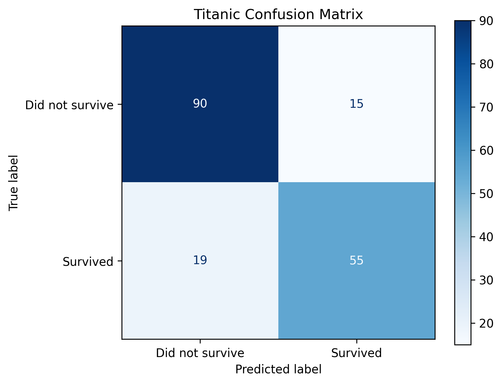

# Titanic Survival Predeictor
ML model to predict the survival rate of a passenger from the Titanic dataset.

## How to run
Make sure you have `python` installed then make a virtual environment in the main directory by doing
`python -m venv venv`.

Install the required dependencies by doing `pip intall -r requirements.txt`.

Train the model by running `python src/train.py`. It will create a `models` directory and save the trained model there.

We can evalute the model by running `python src/eval.py`. We can change what we want to predict by changing the `sample` variable. The prediction will be given in the terminal.

## Information about the model and graphs
The model currently has *80~81%* accuracy it could be enhanced more by feature engineering and some other techniques. The model uses *Logistic Regression* for classification of the passengers.

### Confusion Matrix

This shows how did our model performed in predicitng the correct classes. There are **145** correct predictions (90 + 55) and **34** wrong predictions (15 + 19). 
